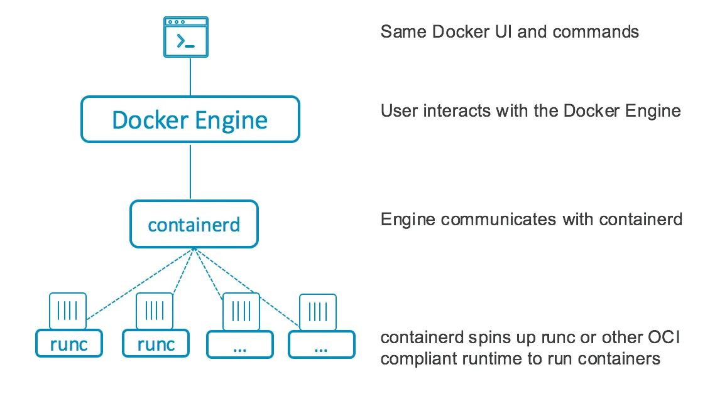

# Introduction of containerd

**containerd** is an industry-standard container runtime with an emphasis on simplicity, robustness, and portability. 
It's available as a `daemon` for Linux and Windows. It manages the complete container lifecycle of its host system, 
from image transfer and storage to container execution and supervision to low-level storage to network attachments 
and beyond.

> containerd is designed to be embedded into a larger system(e.g. K8s), rather than being used directly by developers or end-users.


## 1. Why containerd?

### 1.1 Kubernetes Native Support (CRI)

The old docker runtime does not directly support the CRI(Container Runtime Interface) of k8s, so Kubernetes had to use 
a middle layer called `dockershim` to communicate with Docker. This adds overhead and complexity.

### 1.2 Efficiency and Performance

`Containerd` is a purpose-built container runtime that is `lightweight and efficient`. Since it is not tied to 
Docker's other functionalities (like image building or extensive CLI commands), it is optimized solely for 
container management.

- **Lower Overhead**: Docker includes additional features and a higher-level daemon that isn't needed for Kubernetes, 
                adding extra layers of processing.
- **Reduced Resource Consumption**: By cutting out the Docker daemon, containerd consumes fewer resources, 
                 improving the overall performance and reducing the memory and CPU usage on each node.

> As a result, you can't use containerd to build docker image. You can only pull image and deploy a container.

### 1.3 OCI compliant

Containerd uses **runc** as low-level container runtime, which implements the **Open Container Initiative (OCI) Runtime Specification**. 
**OCI spec** defines how containers should be created and run. As a result, **runc is a standard** across container runtimes.

runc interacts directly with the Linux kernel (e.g. cgroups and seccomp) to execute the containers, and make sure  
that containers run in isolated and secure environments. .

## 2. Integration in Docker engine
Containerd can be used inside Docker engine. Below figure shows the general architecture.



## 3. Integration in K8s 

In k8s worker nodes, a daemon called `kubelet` is responsible for communicating with the container runtime(e.g. containerd).
This communication is ensured by **CRI (Container Runtime Interface)**, which is a Kubernetes-specific API that 
allows Kubernetes to interact with various container runtimes in a standardized way. 
Kubernetes uses this interface to manage containers on nodes, regardless of the underlying container runtime. 

### 3.1 General workflow

Step1: users issue a command `kubectl apply -f deployment.yaml`, kubectl apply sends a `REST request` to the 
       **Kubernetes API server** to create or update the Deployment resource defined in the deployment.yaml file.

Step2: The **API server** validates the request (ensuring the resource definition is correct) and stores the 
       Deployment object in **etcd**. This object represents the desired state: the number of replicas, 
       the pod template, labels, etc.

Step3: The **controller manager** gets notified by the API server about the new Deployment. It continuously watches 
       for changes to Deployment resources, detects the new or updated Deployment object. If the current stat does not
       correspond the desired state. New pods creation request will be sent to scheduler.

Step4: The **scheduler** takes into account factors such as resource requests (CPU, memory), node availability, taints, 
       and affinity/anti-affinity rules to `assign the pod to a suitable node`.

Step5: **Kubelet** of the target node receives the pod specs from the scheduler. It passes the request to `Containerd through the CRI`.

Step6: **Containerd** then pulls the required container images from the specified container 
       registry (e.g., DockerHub, Google Container Registry) if they are not already present on the node.
       Containerd creates and starts the containers based on the pod spec, handling everything from resource 
       allocation (CPU, memory) to networking and storage. It also manages container logs and any other 
       runtime-specific functions (e.g., container pause/unpause).

Step7: The **Kubelet** continues to monitor the pod's health, and if a pod or container fails, Kubernetes will 
       attempt to restart it to maintain the desired state.


## 4. Other important client

Containerd uses **CRI** to communicate with k8s, it also provides two other clients:

- **CTR**: is a low-level CLI tool for users interacting directly with containerd. 
- **crictl**: 

### 4.1 CTR

It is primarily used for debugging, testing, and interacting with containerd without going through higher-level tools 
like `CRI or Docker`. While ctr can be used to manage containers, images, namespaces, and snapshots, 
**it is not recommended for general-purpose use in production environments.**

### 4.2 crictl

`crictl` is a lightweight command-line tool for managing container runtimes. It is particularly useful for 
Kubernetes environments that use CRI-compatible runtimes. It's not bundled with contianerd. You need to follow
the below steps to install `crictl` on an Ubuntu/debian system.

You can find the official github page [here](https://github.com/kubernetes-sigs/cri-tools/)

My k8s cluster version `1.31.1`, so I choose 1.31.1 as the crictl version

```shell
# Step1: get the source
VERSION="v1.31.1"  # You can change this to the latest version
wget https://github.com/kubernetes-sigs/cri-tools/releases/download/$VERSION/crictl-$VERSION-linux-amd64.tar.gz

# step2: unzip the source
tar -xzvf crictl-v1.31.1-linux-amd64.tar.gz
# you should see a bin called crictl after unzip

# step3: copy the bin to your local bin, so you can call it from anywhere
sudo mv crictl /usr/local/bin/

# step4: check the version
crictl --version

# step5: config crictl endpoint
sudo vim /etc/crictl.yaml

# put the following content in it, you need to choose one which fit your installation
# example configuration for Docker:
runtime-endpoint: unix:///var/run/cri-dockerd.sock

# for contained:
runtime-endpoint: unix:///run/containerd/containerd.sock

# step6: check your endpoint info
sudo crictl info

```

> If you have an older version of kubeadm, the newer version of the crictl should work without problems. 

If you see the details of your endpoint, now you can run any crictl command 
Below are a list of useful command

```shell
# list all existing images
sudo crictl images

# pull a container image
sudo crictl pull <image-name>:<tag>
# for example
sudo crictl pull nginx:latest

# delete a image
sudo crictl rmi <image-name>
# example
sudo crictl rmi nginx:latest

# view all running pods
sudo crictl pods

# list all containers (running and stopped)
sudo crictl ps -a

# view container logs
sudo crictl logs <container-id>

# start/stop a container
sudo crictl start/stop/pause/unpause <container-id>

# Attach to a Running Container
sudo crictl attach <container-id>

# execute a command inside a running container
sudo crictl exec <container-id> <command>
# for example
sudo crictl exec 712fe34fbf5b9  /bin/sh
```


