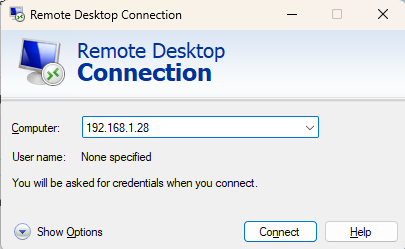
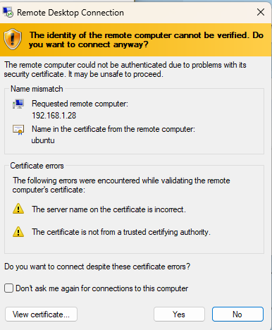
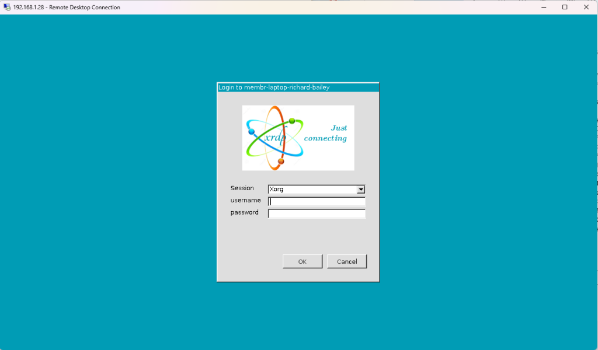

# Remote desktop access

If your linux runs on cloud, and you wish access this server's desktop interface, the below tutorial can help you.
I have tested three solutions:
- X2go: https://wiki.x2go.org/doku.php
- Nomachine: https://www.nomachine.com/
- xrdp:


## X2go and nomachine

If you have no other choice, these two solutions can be your last hope. They both have many bugs. The screen resolution
for example is a pain in the ass to setup correctly. Nomachine also requires admin rights on both client and server.

You can follow their official doc to install them.

## Xrdp

**xrdp** is a free and open-source implementation of `Microsoft RDP (Remote Desktop Protocol) server` that enables operating 
systems other than Microsoft Windows (such as Linux and BSD-style operating systems) to provide a fully functional 
`RDP-compatible remote desktop` experience. It works by bridging graphics from the X Window System to the 
client and relaying controls from the client back to X Window Server.


The initial versions of the XRDP project relied on a `local VNC server installation`. Due to the `slow performance` of 
forwarding to a VNC server, the developers introduced the **X11rdp mode**,  resulting in improved draw times and 
an overall better user experience. In 2019, the XRDP developers announced the **xorgxrdp** project as the replacement 
to the `X11rdp mode`, which is the default mode that XRDP uses in new installations.

You can visit their [github page](https://github.com/neutrinolabs/xrdp), if you are interested in how it works.

## Xrdp server side installation

This tutorial is tested under ubuntu 24.

```shell
# Step 1 – Update Ubuntu
sudo apt-get update -y

sudo apt-get upgrade #optional

# Step 2 – Install XRDP
sudo apt install xrdp -y
sudo systemctl status 

# Step 3 – Configure SSL
# xrdp daemon is lanuched by the service account xrdp, it requires certain privilege to access SSL/TLS certificates stored on the system.
# The below command add user xrdp to the group ssl-cert
sudo adduser xrdp ssl-cert

# restart the deamon
sudo systemctl restart xrdp

# Add a Firewall Rule to allow inbound and outbound traffic on port 3389
sudo ufw allow from 192.168.0.0/24 to any port 3389
sudo ufw allow 3389
sudo ufw reload 

# Step 4 – Test the XRDP connection
```

## Xrdp client side installation and configuration

The client side installation happens on the pc which you want to use to connect to the server.

### For Windows:

1. Search for “Remote Desktop Connection”: You can do this by typing “Remote Desktop Connection” in the Windows search bar.
2. Open the Remote Desktop Connection application: Click on the application in the search results. You should see below
GUI. 


3. Enter the Computer’s IP Address or Hostname: In the Remote Desktop Connection window, you’ll need to enter the 
IP address or hostname of the computer you want to connect to.
4. Click “Connect”: Once you’ve entered the required information, click the “Connect” button. When you get the certificate warning, click YES.


5. Enter Credentials: You’ll be prompted to enter the username and password for the computer you are connecting to. 
Ensure you have the correct credentials. The session value should be **Xorg**. If you choose `xvnc`, you need to install
the required packages on the server side.
6. Connect: After entering the credentials, click “OK” or “Connect” to establish the RDP connection.



### For Mac

1. Download Microsoft Remote Desktop from the App Store: If you don’t have it already, you can download the Microsoft 
Remote Desktop application from the [Mac App Store](https://apps.apple.com/us/app/microsoft-remote-desktop/id1295203466?mt=12).
2. Open Microsoft Remote Desktop: Once installed, open the application.
3. Click on “New”: To create a new connection, click on the “+” icon or select “New” from the File menu.
4. Enter Connection Details: Enter the PC name or IP address, and configure other settings as needed.
5. Save the Connection: Click “Add” to save the connection.
6. Connect: Select the newly created connection and click “Start” to initiate the RDP session.

### For linux

You can download various rdp clients:
- FreeRDP
- rdesktop
- KRDC
- NeutrinoRDP

## Troubleshoot

To debug `xrdp`, you can get the log from `/var/log/xrdp.log`.

### Wrong credential 

If you get this message `login failed`, you have mistyped your details or logged in to an active session 
(someone else is logged on with the same login). Linux allows multiple console connections, but only one GUI desktop
connection. You need to close other GUI desktop connection

### Black screen

For recent linux version(ubuntu 22, 24), you may get a BLACK screen. Because xrdp uses the Xorg(implementation of the X11 protocol
of the X window System) to do the remote display. But ubuntu 22, 24 use **Wayland**, so it misses some important packages. 

Below command will install **dbus-x11** package, which provides a D-Bus session bus for each X11 display.

```shell
sudo apt-get install dbus-x11

# a script will be generated, normally you don't need to modify it. 
sudo nano /etc/xrdp/startwm.sh

# just check if it matches with the below content
if test -r /etc/profile; then
        . /etc/profile
fi

if test -r ~/.profile; then
        . ~/.profile
fi

test -x /etc/X11/Xsession && exec /etc/X11/Xsession
exec /bin/sh /etc/X11/Xsession


# if everything matches, just reboot the server
sudo reboot
```

### custom xrdp port

The **xrdp** server listens for incoming RDP connections on port number **3389** by default. 

To instruct xrdp to listen on a different port, you need to edit the `xrdp.ini`

```shell
sudo vim /etc/xrdp/xrdp.ini

# Locate the port directive in the [Globals] section and set the desired value. In this example, the RDP port is 49952:
port=49952

# save the file and restart the daemon
sudo systemctl restart xrdp

# don't forget change the firewall if you have one
sudo ufw status
sudo ufw allow 49952/tcp
sudo ufw reload
```

For the client side, you need to specify the port number inside the `computer ip input` with the form **IP_address:port_number**.


