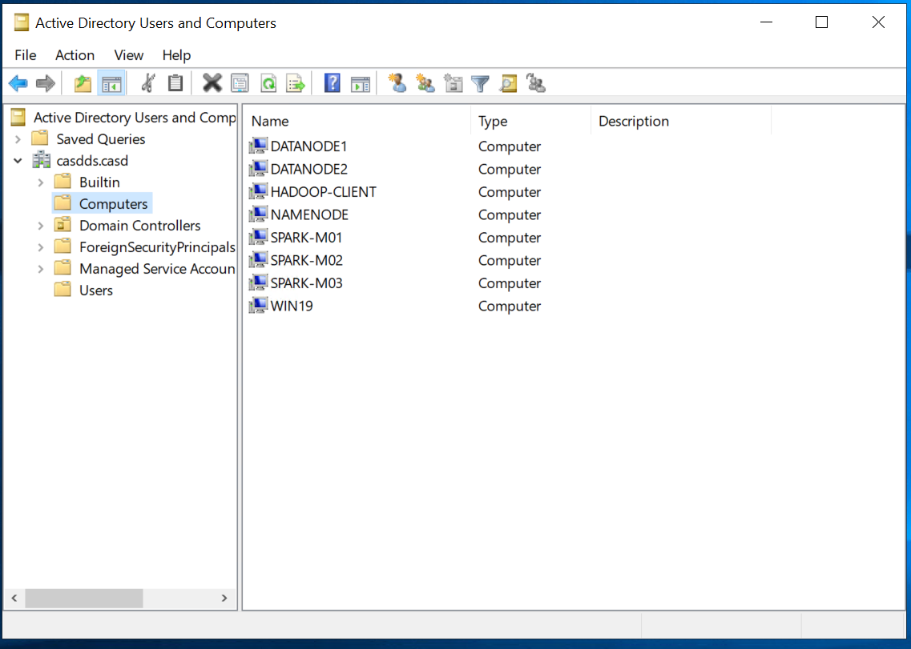
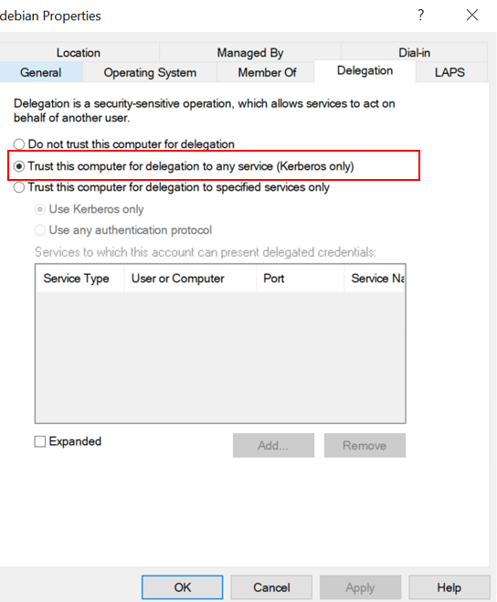
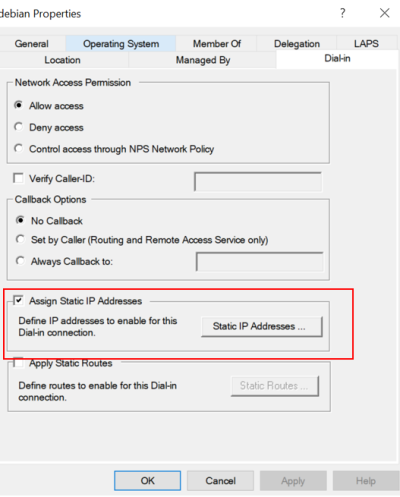
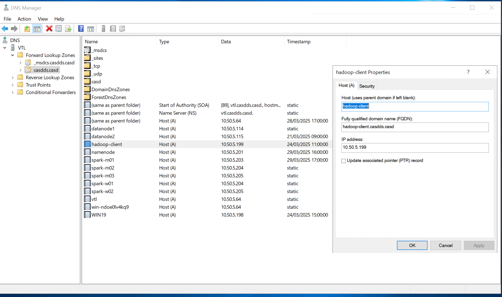
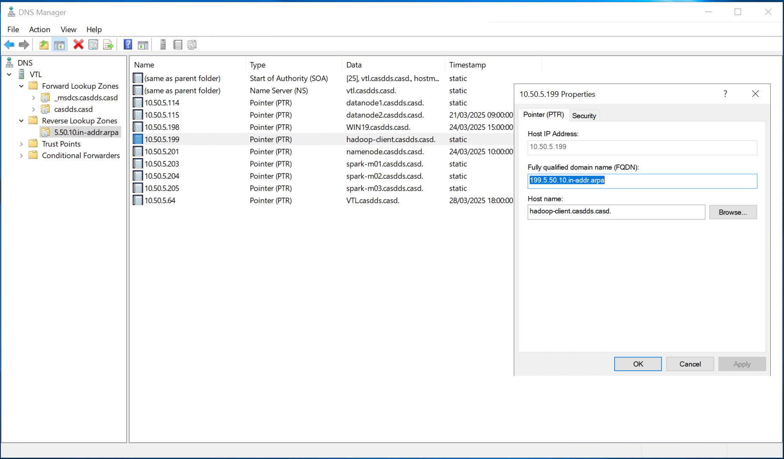

# Configure debian server to use AD/Krb for sshd authentication

In this tutorial, we show how to configure sshd, pam, sssd, to allow a `debian 11` server to use **AD/Krb** as 
authentication server. We will follow the below steps:

We suppose we have :
- `AD/Krb` : The ip address is `10.50.5.64`, ad domain name `casdds.casd`, krb realm name `CASDDS.CASD`, hostname `auth`, fqdn is `auth.casdds.casd`
- `debian 11`: ip address is `10.50.5.199`, hostname is `hadoop-client`, fqdn is `hadoop-client.casdds.casd`

## Step 1: Prerequisite

### 1.1 Reset hostname of hadoop-client

The hostname is essential for the server to have a valid FQDN in the domain, so we need to make sure the hostname
is set correctly. Follow the below steps:
- set system hostname
- update /etc/hosts

```shell
# general form
sudo hostnamectl set-hostname <custom-hostname>

# for example 
sudo hostnamectl set-hostname hadoop-client

# check the new hostname with below command
hostname

# expected output
hadoop-client
```

> you can also directly edit the hostname config file(not recommended) by using `sudo vim /etc/hostname`

Update `/etc/hosts`:

```shell
sudo vim /etc/hosts 

127.0.1.1 hadoop-client.casdds.casd hadoop-client
10.50.5.199	hadoop-client.casdds.casd	hadoop-client

```

### 1.2 Update system packages in hadoop-client

```shell
sudo apt update 
sudo apt upgrade
```

### 1.3 Change dns server settings in hadoop-client

To join the server into an AD domain, you must use the AD as dns server.

Edit the `/etc/resolv.conf` :

```shell
search casdds.casd
nameserver 10.50.5.64
nameserver 8.8.8.8
```

### 1.4 Install the required packages in hadoop-client

```shell
sudo apt install realmd sssd sssd-tools libnss-sss libpam-sss adcli samba-common-bin krb5-user oddjob oddjob-mkhomedir packagekit -y
```

## Step 2 : Join the debian server(hadoop-client) to the AD domain

### 2.1. Check if the domain can be reached or not

```shell
realm discover CASDDS.CASD
```
> - If the error message is realm command is unknown, open a new shell.
> - If the error message is CASDDS.CASD is unknown, check the dns server ip is reachable, and dns server name setup is correct.

### 2.2. Join the server(hadoop-client) to the AD domain
 
To execute the below command, you must have an account with `domain administrator` privilege :

```shell
sudo realm join --user=Administrateur CASDDS.CASD
```

If there is no error message, it means your server has joined the domain.

### 2.3 Configure the linux server(hadoop-client) account in AD

If the `hadoop-client` has success joined the AD domain, you should see the server appears in the `Computer` section in
the AD manager GUI. Check the below figure



To check, you need to connect to the `Windows Server` -> Open `AD manager` -> In `Users and Computers` subfolder of 
Active Directory. You should find a line of `HADOOP-CLIENT`. Right Click on it, and select `properties`, you should
see the below pop-up window




Select the `Trust this computer for delegation to any service` option in `Delegation`. 

Click on the `Static IP address` option in `Dial-in`, then put the address ip of the `hadoop-client`. 

> You can add a new computer in AD manually, but we don't recommend that. Try to use the `realm join`

## Step 3: Config AD/Krb, DNS server to well integrate hadoop-client

To make the debian server (hadoop-client) fqdn `recognizable` and `reachable` by the other servers in the domain,
we need to configure the dns server 

### 3.1. Check the dns entries in windows server

Open the `dns manager` in the Windows server (`auth.casdds.casd`). Check the forward lookup and reverse lookup.
You need to make sure the `hostname, fqdn and ip address` are correct. The two below figures are examples
of the `hadoop-client` config.





> Normally, these entries are created automatically by the `realm join` command. If they are not created correcly, you 
> need to create them manually.

### 3.2. Check the SPN (Service Principal Name) in Windows server   

Every registered computer in the domain should have a `valid SPN (Service Principal Name)`. You can check the name by 
using the below command. You can open a `powershell prompt` in the `AD/krb` server.

 
```powershell
setspn -L hadoop-client

# expected output
Registered ServicePrincipalNames for CN=HADOOP-CLIENT,CN=Computers,DC=casdds,DC=casd:
        RestrictedKrbHost/hadoop-client.casdds.casd
        RestrictedKrbHost/HADOOP-CLIENT
        host/hadoop-client.casdds.casd
        host/HADOOP-CLIENT
```

If you don't see any outputs, you can create a `SPN (Service Principal Name)` manually. Below is the command to do so.

```shell
# create a new spn and link it to the hadoop-client(AD account)
# The -S option adds an SPN only if it does not already exist (avoids duplicates).
setspn -S host/hadoop-client.casdds.casd hadoop-client

# generate a keytab for principal  host/hadoop-client.casdds.casd@CASDDS.CASD
ktpass -princ host/hadoop-client.casdds.casd@CASDDS.CASD -mapuser HADOOP-CLIENT$ -pass * -ptype KRB5_NT_PRINCIPAL -crypto AES256-SHA1 -out hadoop-client.keytab
```
Below lines are the explanation of the commands:
- The `ktpass` command can generate a keytab file for Kerberos authentication. 
- `-princ host/hadoop-client.casdds.casd@CASDDS.CASD` defines the Kerberos principal name.
- `-mapuser HADOOP-CLIENT$` maps the Kerberos principal to the account (HADOOP-CLIENT) in Active Directory (AD). The `$` indicates it's a computer account (not a user).
- `-crypto AES256-SHA1` specifies that only the `AES256-SHA1` crypto algo is supported. You can replace it with `ALL` to specify all available cryptographic algorithms should be supported for encryption.
- `-ptype KRB5_NT_PRINCIPAL` specifies the principal type as KRB5_NT_PRINCIPAL, which is used for standard Kerberos authentication(for services, use KRB5_NT_SRV_HST).
- `-pass *` prompts the user to enter the password manually. Typically, computer accounts in AD have auto-generated passwords.
- `-out hadoop-client.keytab` saves the keytab file, which will be used by the linux server(hadoop-client) for authentication.

> The `hadoop-client.keytab` file is copied to the hadoop-client, so it can use this keytab for Kerberos authentication.
> `hadoop-client` can use the kerberos ticket to prove the identity of `hadoop-client`.

After coping the `hadoop-client.keytab` file to `hadoop-client`, you can use the below command to check keytab contents:

```shell
klist -k /tmp/hadoop-client.keytab  

# you should see outputs like
"host/hadoop-client.casdds.casd"
```

### 3.3 Rename the keytab file in linux(hadoop-client)

In linux, many Kerberos-aware applications (e.g. kinit, Hadoop, etc.) expect the keytab file to be named `krb5.keytab` 
and located in `/etc/` by default. We can use the below commands

```shell
sudo mv hadoop-client.keytab /etc/krb5.keytab

# Ensures only root can read it (for security).
sudo chmod 600 /etc/krb5.keytab
```

### 3.4 Leave and rejoin the realm

If there are errors that you can't resolve, you can always leave the realm and rejoin

```shell
sudo realm leave CASDDS.CASD

sudo realm join --user=Administrateur CASDDS.CASD
```


### 3.5. Create a service account in AD for sssd daemon.

As we explained before, the linux server relies on `sssd` daemon to get the `user id and groups` from the AD server.
This requires sssd to have an account that allows him to access AD.

You need to create a service account `sssd` in `Active Directory manager`. Then use the below command to
create a `principal` and the `keytab` file.

```shell
ktpass -princ sssd@CASDDS.CASD -mapuser sssd -crypto AES256-SHA1 -ptype KRB5_NT_PRINCIPAL -pass * -out sssd.keytab
```

Copie the keytab file to the debian server(hadoop-client):
```shell
scp sssd.keytab sssd@debian.casdds.casd:/tmp/
```
Put the keytab file in /etc

```shell
sudo cp /tmp/sssd.keytab /etc/
# need to check the acl of the file, 644 is too open for me
sudo chmod 644 /etc/sssd.keytab
sudo chown root:root /etc/sssd.keytab
```

## Step 4 : Configuration of SSSD, PAM and Kerberos

We will follow the below order to configure each component:
- kerberos client: configure krb client to connect to the target krb Realm
- sshd/pam: configure sshd server to use pam as authentication backend
- pam/sssd: configure pam to use sssd as backend
- sssd/krb: configure sssd to use krb plugin

### 4.1 Configure kerberos client in debian(hadoop-client) server 

```shell
# install the required package
sudo apt install krb5-user

# edit the config file `/etc/krb5.conf`  
sudo vim /etc/krb5.conf
```
Put the below content in the file `/etc/krb5.conf` 

```shell
 [libdefaults]
        default_realm = CASDDS.CASD

        default_tkt_enctypes = aes256-cts-hmac-sha1-96 aes128-cts-hmac-sha1-96
        default_tgs_enctypes = aes256-cts-hmac-sha1-96 aes128-cts-hmac-sha1-96
        permitted_enctypes   = aes256-cts-hmac-sha1-96 aes128-cts-hmac-sha1-96
        kdc_timesync = 1
        ccache_type = 4
        forwardable = true
        proxiable = true
        ticket_lifetime = 24h
        dns_lookup_realm = true
        dns_lookup_kdc = true
        dns_canonicalize_hostname = false
        rdns = false
         allow_weak_crypto = true


[realms]
        CASDDS.CASD = {
                kdc = 10.50.5.64
                admin_server = 10.50.5.64
        }
…..
[domain_realm]
….
        .casdds.casd = CASDDS.CASD
        casdds.casd = CASDDS.CASD
```

To check the krb client, use the below command

```shell
# ask a ticket kerberos
kinit host/hadoop-client.casdds.casd

# the short version should work if the keytab is in place, if not you can specify the path of keytab
kinit -kt /etc/krb5.keytab host/hadoop-client.casdds.casd
```

### 4.2. Configure sshd to use pam 

We need to edit two files:
- `/etc/ssh/sshd_config` (configuration for the ssh server)
- `/etc/ssh/ssh_config` (configuration for the ssh client)

In `/etc/ssh/sshd_config`, enable the below lines
```shell

# disable other authentication methods
ChallengeResponseAuthentication no
PasswordAuthentication no

# use pam as authentication backend
UsePAM yes

# GSSAPI options for sshd server to accept GSSAPI, it's required for the server to accept krb ticket as 
# credentials
# 
GSSAPIAuthentication yes
# Cleans up the Kerberos credentials after the session.
GSSAPICleanupCredentials yes
# Ensures that the SSH client does not strictly check for a valid acceptor name in the Kerberos tickets.
GSSAPIStrictAcceptorCheck no
# Allows the exchange of Kerberos keys for stronger encryption.
GSSAPIKeyExchange yes


X11Forwarding yes

PrintMotd no


# Allow client to pass locale environment variables
AcceptEnv LANG LC_*

# override default of no subsystems
Subsystem       sftp    /usr/lib/openssh/sftp-server

```

> You need to restart the sshd service to enable the new config
> 

```shell
sudo systemctl restart sshd
```

In the `/etc/ssh/ssh_config`, you need to add the below line 
```shell
   Host *
       GSSAPIAuthentication yes
       GSSAPIDelegateCredentials yes
       PasswordAuthentication no
```
> For hadoop-client, the `ssh_config` is not required, because it defines the behaviour of the ssh client.
> It needs to be configured in the ssh client which wants to connect to the hadoop-client ssh server.
> 


### 4.3 Configure pam

All the configuration files for pam are located in `/etc/pam.d/`. The below is the minimum config for the pam
to use sssd daemon as authentication backend.

```shell
### /etc/pam.d/common-auth
sudo: unable to resolve host debian118: Name or service not known
auth      sufficient  pam_unix.so try_first_pass
auth      sufficient  pam_sss.so use_first_pass
auth      required    pam_deny.so
```
```shell
### /etc/pam.d/common-account
sudo: unable to resolve host debian118: Name or service not known
account   required    pam_unix.so
account   sufficient  pam_sss.so
account   required    pam_permit.so
```
```shell
### /etc/pam.d/common-password
sudo: unable to resolve host debian118: Name or service not known
password  sufficient  pam_unix.so
password  sufficient  pam_sss.so
password  required    pam_deny.so
```
```shell
### /etc/pam.d/common-session
sudo: unable to resolve host debian118: Name or service not known
session   required    pam_unix.so
session   optional    pam_sss.so
session   required    pam_mkhomedir.so skel=/etc/skel/ umask=0022
```

### 4.4 Configure sssd

Now we need to configure the sssd daemon. The main config file is in `/etc/sssd/sssd.conf`

```shell
[sssd]
services = nss, pam
domains = casdds.casd
config_file_version = 2

[nss]
homedir_substring = /home

[pam]

[domain/casdds.casd]
ldap_sasl_authid = sssd@CASDDS.CASD
krb5_keytab = /etc/sssd.keytab
default_shell = /bin/bash
krb5_store_password_if_offline = True
cache_credentials = True
krb5_realm = CASDDS.CASD
realmd_tags = manages-system joined-with-adcli
id_provider = ad
fallback_homedir = /home/%u@%d
ad_domain = casdds.casd
use_fully_qualified_names = False
ldap_id_mapping = True
access_provider = ad
ldap_group_nesting_level = 2

```

## 5.configure ssh client on Windows

In windows, there are many ssh clients:
- MobaXterm:
- tabby: https://tabby.sh/
- powershell+openssh
- PuTTY

Below is the instruction on how to install and configure openssh via PowerShell

```shell
Add-WindowsCapability -Online -Name OpenSSH.Client~~~~0.0.1.0
Add-WindowsCapability -Online -Name OpenSSH.Server~~~~0.0.1.0
Start-Service sshd
Set-Service -Name sshd -StartupType 'Automatic'
```

In windows, all the configuration file for openssh is located in `C:\ProgramData\ssh`
If you want to setup the config for ssh server, you can edit the file in `C:\ProgramData\ssh\sshd_config`.

To restart ssh service in windows

```shell
# start sshd service
Start-Service sshd

# restart sshd service 
Restart-Service sshd
```

Configure ssh client 

```shell
# open a notepad
notepad $env:USERPROFILE\.ssh\config

# add the below lines
# * means for all hosts
Host *
    GSSAPIAuthentication yes
    GSSAPIDelegateCredentials yes 
```

You can also define the behaviors host by host, below is an example

```shell
Host hadoop-client
    HostName hadoop-client.casdds.casd
    User pengfei@casdds.casd
    Port 22
    GSSAPIAuthentication yes
    GSSAPIDelegateCredentials yes 
```

## Step 6 : Test the solution

In our scenario, the user follow the below steps:
1. first login to a Windows server, the first ticket kerberos is generated in the Windows server.
2. user ssh to hadoop-client with the ticket kerberos with option forward ticket
3. user try to access hdfs cluster with the forward kerberos ticket

Suppose you have an account `user` in AD with the privilege to connect to `hadoop client` 
\
### 6.1. Understand the ticket

In linux, you can ask a ticket and check the ticket with the below command

```shell
# ask a new ticket, you need to provide a password associated with the provided principal
kinit user@CASDDS.CASD  

# check the ticket contents
klist -5fea   
```
The option:
- **5**: Show only Kerberos 5 tickets (modern Kerberos version).
- **f**: Show ticket flags (like FORWARDABLE, RENEWABLE, etc.).
- **e**: Display encryption type used for the ticket.
- **a**	Show addresses associated with the ticket (if address-restriction of the ticket is activated).

You should see the below output as the ticket content

```shell
Ticket cache: FILE:/tmp/krb5cc_1000
Default principal: user@CASDDS.CASD

Valid starting       Expires              Service principal
03/31/25 10:00:00  03/31/25 20:00:00  krbtgt/CASDDS.CASD@CASDDS.CASD
        Flags: FRI
        Etype (skey, tkt): aes256-cts-hmac-sha1-96, aes256-cts-hmac-sha1-96
        Addresses: 192.168.1.100
```
A kerberos ticket has the below properites:

 - Ticket cache: Location of the ticket. 
 - Default principal: Your Kerberos identity (user@EXAMPLE.COM).
 - Valid starting / Expires: Time range for which the ticket is valid.
 - Service principal: The Kerberos service this ticket is for. (krbtgt/CASDDS.CASD@CASDDS.CASD is a tgt issued by CASDDS.CASD the kdc server)
 - Flags (-f option): F = Forwardable (Can be forwarded to another machine). R = Renewable (Can be extended before expiration). I = Initial (Freshly obtained).
 - Encryption type (-e option): aes256-cts-hmac-sha1-96, means AES-256 encryption with SHA-1 HMAC.
 - Addresses (-a option): Shows the IP addresses associated with the ticket (if address-restricted).

You can ask ticket with special options:

```shell
# below command ask a Forwardable, Renewable for a 7 day validity
kinit -f -r 7d

```
> Based on the kdc configuration, it may or may not generate the ticket.

### 6.2. Connexion SSH

From windows, if the server has joined the domain, windows will generate a kerberos ticket after user logon:

```shell
# check the user ticket
klist -5fea

# for windows ssh client
# -K active la délégation Kerberos
ssh -K user@debian.casdds.casd  

# for linux ssh client
ssh -o GSSAPIDelegateCredentials=yes user@debian.casdds.casd
```


## Appendix :

###  ACL for /etc/sssd/sssd.conf

The Permissions for `/etc/sssd/sssd.conf` must be `600` :

```shell
sudo chmod 600 /etc/sssd/sssd.conf
```
