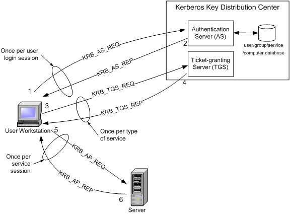

# Introduction of Kerberos server

**Kerberos is a secure authentication protocol** that enables users and services to `authenticate without transmitting 
passwords` over the network. It is built around a `trusted third-party authentication system`, using 
`tickets and encryption keys` to ensure authentication.

The Kerberos server knows "secrets" (encrypted passwords) for all clients and servers under its control. 
These "secrets" are used to encrypt all the messages exchanged during authentication.

## 1. Key components and terms of Kerberos

Below is a list of important components and terms of Kerberos:
- **Key Distribution Center(KDC)**: is responsible for checking user credentials and issuing Tickets
- **Realm**: defines a administrative domain to restrict a security scope. It includes a `KDC` and a `list of Clients(e.g. users, hosts, services)`
- **Principal**: is a **unique identity** in the Kerberos system, which can be a `user, host, or service`.
- **Ticket**: a credential issued by KDC.
- **Keytab**: A file that includes one or more principals and their keys.   


### 1.1 Key Distribution Center(KDC)

**Key Distribution Center, or KDC** is the heart of the Kerberos authentication system. At a high level, it has three parts:

   - A **database**: of the users, hosts and services (known as principals) that it knows about and their respective Kerberos passwords 
   - An **authentication server (AS)**: which performs the initial authentication and issues a **Ticket Granting Ticket (TGT)**
   - A **Ticket Granting Server (TGS)**: that issues `subsequent service tickets` based on the initial TGT for `accessing specific hosts or services`

The KDC is typically hosted on a `Domain Controller (DC) in Active Directory (AD)` or a `Kerberos server` in `MIT/Heimdal implementations`.

### 1.2 Realm 

A **Kerberos realm** defines the administrative domain. It includes a `KDC` and a `list of Clients(e.g. users, hosts, services)`
The `realm name` usually matches the `organization’s domain name, written in uppercase`. For example, if the organization
domain name is `casd.eu`, the realm name should be `CASD.EU`.

> A realm can trust another realm (cross-realm authentication) for authentication across different domains.

### 1.3 Principal

A Principal is a unique identity in the Kerberos system, which can be:

- a user (e.g., user@CASD.EU).
- a host (e.g., host/server01.example.com@CASD.EU).
- a service (e.g., hdfs/namenode.example.com@CASD.EU).

#### 1.3.1 Naming convention of the principal

In theory, A principal in Kerberos 5 is of the following type: `component1/component2/.../componentN@REALM`

But, in practice a `maximum of two components` are used. So we recommand the below naming convention

```text
# for user principal
user1@CASD.EU
user1/admin@CASD.EU

# for host principal
host/<host-url>

# for service principal
```
The instance is optional and is normally used to better qualify the type of user. For example administrator users 
normally have the admin instance. The following are examples of principals referred to users: 
  - 

If, instead, the entries refer to services, the principals assume the following form: Service/Hostname@REALM

The first component is the name of the service, for example imap, AFS, ftp. Often it is the word host which is used 
to indicate generic access to the machine (telnet, rsh, ssh). The second component is the complete hostname (FQDN) 
of the machine providing the requested service. It is important that this component exactly matches 
(in lower case letters) the DNS reverse resolution of the application server's IP address. 
The following are valid examples of principals referring to services:
  - imap/mbox.example.com@EXAMPLE.COM 
  - host/server.example.com@EXAMPLE.COM 
  - afs/example.com@EXAMPLE.COM

The general format of a principal should be 


A user principal requests authentication from the AS. The AS returns a `TGT` that is encrypted using the user 
principal's Kerberos password, which is known only to the user principal and the AS. The user principal decrypts the 
TGT locally using its Kerberos password, and from that point forward, until the ticket expires, the user principal can 
use the TGT to get service tickets from the TGS. Service tickets are what allow a principal to access various services.

Because cluster resources (hosts or services) cannot provide a password each time to decrypt the `TGT`, they use a 
special file, called a keytab, which contains the resource principal's authentication credentials.

The set of hosts, users, and services over which the Kerberos server has control is called a realm.

| Term            | Description                                                              |
|-----------------|--------------------------------------------------------------------------|
| KDC             | The trusted source for authentication in a Kerberos-enabled environment. |
| Kerberos Client | Any machine in the cluster that authenticates against the KDC.           |
| Principal       | The unique name of a user or service that authenticates against the KDC  |
| Keytab          | A file that includes one or more principals and their keys.              |
| Realm           | The Kerberos network that includes a KDC and a number of Clients.        |


### 1.2 Ticket

A ticket is something a client presents to an application server to demonstrate the authenticity of its identity. 
Tickets are issued by the authentication server and are encrypted using the secret key of the service they are 
intended for. Since this key is a secret shared only between the authentication server and the server providing 
the service, not even the client which requested the ticket can know it or change its contents. 
The main information contained in a ticket includes:
 - The requesting user's principal (generally the username); 
 - The principal of the service it is intended for; 
 - The IP address of the client machine from which the ticket can be used. In Kerberos 5 this field is optional and may also be multiple in order to be able to run clients under NAT or multihomed. 
 - The date and time (in timestamp format) when the tickets validity commences; 
 - The ticket's maximum lifetime 
 - The session key (this has a fundamental role which is described below);

Each ticket has an expiration (generally 10 hours). This is essential since the authentication server no longer 
has any control over an already issued ticket. Even though the realm administrator can prevent the issuing of 
new tickets for a certain user at any time, it cannot prevent users from using the tickets they already possess. 
This is the reason for limiting the lifetime of the tickets in order to limit any abuse over time.

## 2. Introduction to Kerberos Authentication protocol

**Kerberos is a network authentication protocol**. It is designed to provide strong authentication for client/server 
applications by using secret-key cryptography. It has the following characteristics:

- It is secure: it never sends a password unless it is encrypted.

- Only a single login is required per session. Credentials defined at login are then passed between resources without the need for additional logins.

- The concept depends on a trusted third party  a Key Distribution Center (KDC). The KDC is aware of all systems in the network and is trusted by all of them.

- It performs mutual authentication, where a client proves its identity to a server and a server proves its identity to the client.


Kerberos introduces the concept of a **Ticket-Granting Server (TGS)**. A client that wishes to use a service has to 
receive a ticket a time-limited cryptographic message giving it access to the server. 
Kerberos also requires an **Authentication Server (AS)** to verify clients. The two servers combined make up a KDC. 

The following figure shows the sequence of events required for a client to gain access to a service using Kerberos 
authentication. Each step is shown with the Kerberos message associated with it, as defined in RFC 
4120 “The Kerberos Network Authorization Service (V5)”.



- Step 1: The user logs on to the workstation and requests service on the host. The workstation sends a message to 
          the Authorization Server requesting a ticket granting ticket (TGT).

- Step 2: The Authorization Server verifies the user’s access rights in the user database and creates a TGT 
           and session key. The Authorization Sever encrypts the results using a key derived from the user’s 
           password and sends a message back to the user workstation. The workstation prompts the user for a 
           password and uses the password to decrypt the incoming message. When decryption succeeds, the user will 
           be able to use the TGT to request a service ticket.

- Step 3: When the user wants access to a service, the workstation client application sends a request to the Ticket 
          Granting Service containing the client name, realm name and a timestamp. The user proves his identity by 
          sending an authenticator encrypted with the session key received in Step 2.

- Step 4: The TGS decrypts the ticket and authenticator, verifies the request, and creates a ticket for the 
           requested server. The ticket contains the client name and optionally the client IP address. It also 
            contains the realm name and ticket lifespan. The TGS returns the ticket to the user workstation. 
           The returned message contains two copies of a server session key  one encrypted with the client password, 
           and one encrypted by the service password.

- Step 5: The client application now sends a service request to the server containing the ticket received in Step 
          4 and an authenticator. The service authenticates the request by decrypting the session key. The server 
         verifies that the ticket and authenticator match, and then grants access to the service. This step as 
         described does not include the authorization performed by the Intel AMT device, as described later.

- Step 6: If mutual authentication is required, then the server will reply with a server authentication message.

## 3. Time synchronization

To prevent `replay attacks`, Kerberos uses `timestamps` as part of its protocol definition. For timestamps to 
work properly, the `clocks of the client and the server need to be in synch as much as possible`. Since the 
clocks of two computers are often out of synch, administrators can establish a policy to establish the 
maximum acceptable difference to Kerberos between a client's clock and server's clock. If the difference between 
a client's clock and the server's clock is less than the maximum time difference specified in this policy, any timestamp used in a session between the two computers will be 
considered authentic. The maximum difference is usually set to five minutes.

> Note that if a client application wishes to use a service that is "Kerberized" (the service is configured to perform 
  Kerberos authentication), the client must also be Kerberized so that it expects to support the necessary message responses.