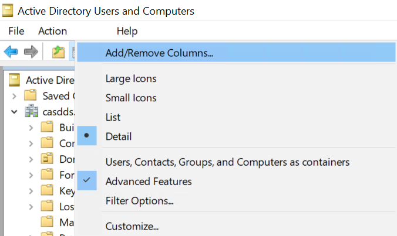
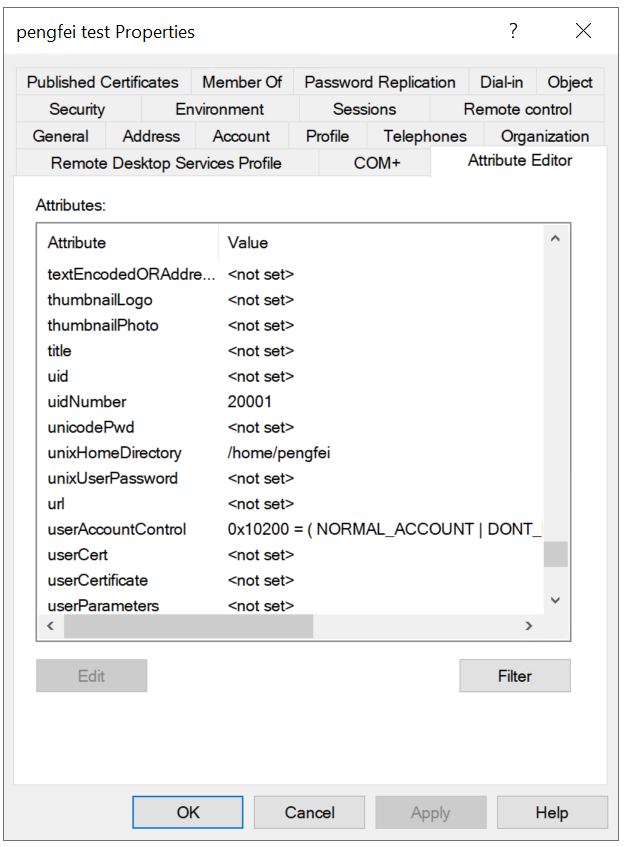

# Configure sssd to use static uid, gid

**POSIX (Portable Operating System Interface)** is `UNIX/Linux standards for identity and access control`. A `POSIX` 
account use specific attributes such as
- uidNumber – Unique User ID (UID)
- gidNumber – Primary Group ID (GID)
- homeDirectory – User's home directory path 
- loginShell – The default shell (e.g., /bin/bash)

These attributes allow UNIX/Linux systems to recognize, authenticate users, and create user workspace.

By default, AD does not use **POSIX attributes** for user and group.  Instead, AD relies on:

 - **Security Identifiers (SIDs)**: Every user and group has a `SID`, which is a unique identifier in Windows.
 - `sAMAccountName`: pliu (This is legacy login, )
 - **UserPrincipalName (UPN)**: pliu@casd.eu (authentication in modern windows server)

## 1. Default behavior when sssd uses AD as authentication backend

The default behavior in `SSSD` and `Winbind` is to use `auto id mapping`. SSSD will dynamically generate UIDs and GIDs
from the `AD objects's ObjectSID`. This will lead to inconsistent UIDs and GIDs across machines.

In certain scenarios, it will create conflicting ACL in user home. For example, if a user with AD account with name `test`
login to a linux server, a user home will be created `/home/test`. If the user account is deleted, and a new account
`test` is created, when the new `test` user login to the linux server, it will user /home/test as home dir too.
But the new and old `test` will have different uid. So the old files in /home/test will have old uid as owner, the new 
`test` user can't access it. 

To avoid inconsistent UIDs and GIDs, we recommend you to **use static uidNumber and gidNumber**.


## 2. Configure sssd to user static uidNumber and gidNumber.

To configure sssd to user static uidNumber and gidNumber, follow the below steps
1. Add posix attributes in AD
2. Configure sssd to read posix attributes

### 2.1 Adds posix attributes in AD

If SSSD wants to use static uidNumber and gidNumber, the AD server must have those attributes.
Before Windows server 2016. The AD server can use `rfc2307` schema, which allows us to create posix compatible user 
accounts and groups. This feature has been removed since `Windows server 2016`. But you can still add attributes such
as `uidNumber`, `gidNumber` to a user account or group. 

Open `AD users and groups gui`-> on the toolbar, click on `view`-> Select `advance features` -> now when you double-click on 
a user account, you will see a tab called 





The official doc can be found [here](https://learn.microsoft.com/en-us/archive/blogs/activedirectoryua/identity-management-for-unix-idmu-is-deprecated-in-windows-server).


### 2.2 Configure sssd to read posix attributes

Before changing your sssd configuration, make sure `AD Objects have gidNumber and uidNumber Attributes`.

#### 2.2.1 For AD < Windows server 2016. 

Configure the AD server to use `rfc2307` schema, and create posix compatible accounts and groups. Then add the below 
conf in `/etc/sssd/sssd.conf`

```ini
[domain/YOURDOMAIN]
id_provider = ad
access_provider = ad
ldap_id_mapping = False
ldap_schema = rfc2307
```

#### 2.2.1 For AD >= Windows server 2016. 

Add the below conf in `/etc/sssd/sssd.conf`

```ini
[domain/YOURDOMAIN]
id_provider = ad
access_provider = ad
ldap_id_mapping = False  # Important: Forces usage of uidNumber/gidNumber
ldap_user_uid_number = uidNumber
ldap_user_gid_number = gidNumber
ldap_group_gid_number = gidNumber
enumerate = True  # Optional: Lists all users and groups
```


### 2.3 Restart sssd and check uid, gid

````shell
# restart sssd
systemctl restart sssd
# clear sssd cache
sss_cache -E

# check user id and groups
id <uid>

# you should see the output id value matches the value which you deined in AD

# check group id
getent group <groupname>
````